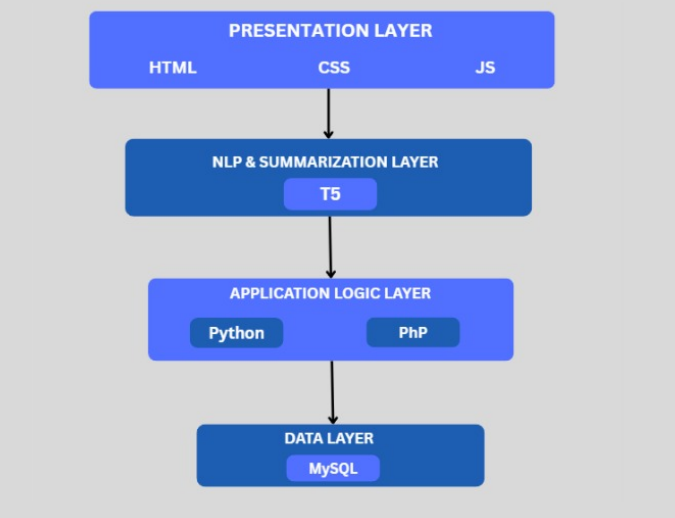
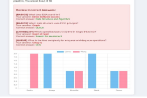
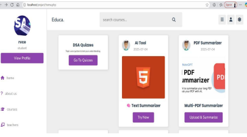

# EduFused – AI-Powered Learning for Every Student  

An **AI-powered adaptive learning platform** designed to help students overcome challenges in technical subjects like **Programming, Data Structures, and Mathematics**.  
EduFused integrates **Natural Language Processing (NLP)**, a **chatbot for real-time doubt solving**, and **quiz-based personalized learning paths** to create an engaging and student-friendly learning ecosystem.  

---

## Features  

### Intelligent NLP Chatbot  
- Acts as a **virtual tutor**, providing **real-time answers** to student queries.  
- Built with **Python + NLP libraries** (spaCy, Transformers).  
- Supports both **text** and **voice-based interactions**.  
- Handles queries like:  
  - *"What is Generative AI?"*  
  - *"Explain Bubble Sort with an example."*  
- Designed to simulate **human-like conversations**, offering contextual feedback, grammar correction, and vocabulary assistance.  

### Adaptive Learning Flow  
- Begins with a **diagnostic quiz** to assess the learner’s strengths and weaknesses.  
- Uses **quiz analytics & performance graphs** to recommend **personalized learning modules**.  
- Provides **topic-wise quizzes** for self-assessment and reinforcement.  

### Student-Centric Design  
- Lightweight, **browser-based platform** (no installations required).  
- **Responsive UI** built with HTML, CSS, and JavaScript.  
- Backend powered by **Python + PHP**, with **MySQL database** for storing user progress.  
- Tutors/mentors can upload notes and quizzes to support the learning community.  

---

## System Architecture  

EduFused follows a modular **client-server architecture**:  

  

---

## Tech Stack  

  

- **Programming Languages:** Python, PHP, JavaScript  
- **Frontend:** HTML, CSS, JS  
- **Backend:** Python (for NLP & chatbot), PHP (for server-side handling)  
- **Database:** MySQL  
- **AI/NLP Models:** Hugging Face Transformers, Tokenizers, spaCy  
- **Environment:** XAMPP / Localhost for deployment  

---

## Screenshots (Sample)  

| Chatbot Interaction | Performance Graphs | Tutor Dashboard |  
|---------------------|--------------------|----------------|  
|  |  |  |  

---

## Workflow 

  

1. **Student registers/login** to platform.  
2. Takes a **diagnostic quiz** → system evaluates performance.  
3. **Personalized learning modules** are recommended.  
4. Student can:  
   - Interact with the **chatbot** for real-time academic queries.  
   - Take **topic-wise quizzes** and track progress through **performance graphs**.  
5. Tutors can **contribute notes/quizzes** to help learners.  

---

## Future Enhancements  

- 📱 Mobile app (Android/iOS) for on-the-go learning  
- 🔊 Advanced voice interaction (Whisper API, better ASR models)  
- 🧾 Grammar correction & adaptive chatbot memory  
- 🎮 Gamified learning (badges, rewards, quiz streaks)  
- 🌐 Multi-language chatbot support (regional + foreign languages)  

---

## 💡 Highlight  

The **NLP chatbot** is the **core innovation** of EduFused — designed as a **student-friendly AI tutor** that not only answers queries but also supports **adaptive learning** through quizzes and performance analysis.  

---

